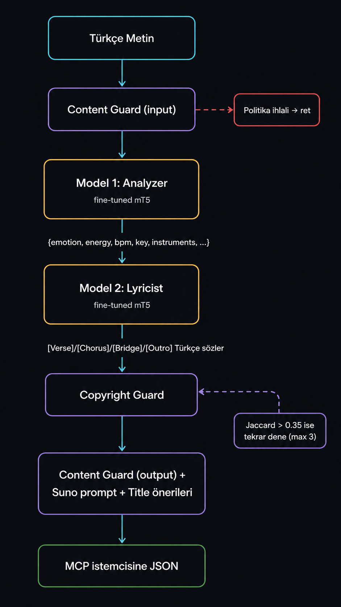

# Story-to-Music

> Türkçe metinleri **Suno** ve **Udio** için hazır müzik promptlarına ve yapılandırılmış şarkı sözlerine çeviren, kendi fine-tuned modelleriyle çalışan **MCP (Model Context Protocol)** sunucusu.

[](https://hub.docker.com/r/sbugrayy/story-to-music-mcp)
[](LICENSE)
[](https://huggingface.co/google/mt5-small)

Bir hikâye, konsept veya taslak veriyorsunuz — sistem duygu haritasını analiz ediyor, müzik parametrelerini çıkarıyor ve **[Verse]/[Chorus]/[Bridge]/[Outro]** etiketli Türkçe şarkı sözleri üretiyor. Hepsi local'de, harici API olmadan, tek `docker run` ile.

<p align="center">
  <video src="docs/demo.mp4" controls autoplay loop muted playsinline width="80%"></video>
</p>

---

## Örnek Çıktı

**Girdi:**
> Bir zamanlar büyük bir aşk yaşamıştım. Sonra o aşk gitti, geride sadece anılar kaldı. Her gece pencereden dışarı bakıyorum, yağmurun sesi hatırlatıyor onu bana.

**Çıktı:**
```json
{
  "style_prompt": "Turkish yearning song, moderate tempo, ney flute, saz, 80 BPM, A minor, raspy, dramatic vocal",
  "structured_lyrics": "[Verse 1]\nGecenin parıltısı, yağmur dolu yüze\nGökyüzünde kafama bakıyor\nİnsanın ötesinde bir çocuk gibi\n\n[Chorus]\nGüneşin içinde kalan benim parçam\n\n[Bridge]\nRüzgarın içindeki yıldızlar\nYağmur suları dumanla oynarken\n...",
  "title_suggestions": ["Uzaktan", "Hatıra", "Gecenin Parıltısı"],
  "parameters": {
    "emotion": "özlem",
    "energy": 4,
    "bpm": 80,
    "key": "A minor",
    "instruments": ["ney", "saz"],
    "vocal_style": "erkek, kısık, dramatik"
  }
}
```

Bu çıktıyı doğrudan Suno/Udio'ya yapıştırıp şarkı üretebilirsiniz.

---

## Canlı Test (Claude Code + MCP)

Aşağıdaki çıktı **gerçek bir MCP tool call** sonucudur — Docker Hub'daki imajdan
çalışan container, sıfır harici API:

**Girdi:**
> "story-to-music tool'unu kullanarak şu metni Suno için müzik prompt'una çevir: *Bir zamanlar büyük bir aşk yaşamıştım. Sonra o aşk gitti. Her gece pencereden bakıyorum, yağmur onu hatırlatıyor.*"

**Çıktı (~30 saniye, ilk container start hariç):**

```
Style Prompt:
"Dramatic and melancholic vocals with a touch of sorrow. BPM: 80, Key: A minor."

Şarkı Sözü:
[Verse 1]
Gölgenin altında uzun bir yol, sıcak bir aşk
Gözlerimde karanlık, her an için bir yeryüzü
Kalabalık gecelerin sonunda
Seninle birlikte kaybolmuş gibi, seninle oynadığım ışıklar

[Chorus]
Ne var ki ne yapacağımı bilmiyorum
Ama her şeyi kaybetmiş mi?

[Bridge]
Gökyüzünde rüzgarla dolu yolda
Sokaktan kaçmak isteyen her şey
Daha da bana sarılmıyor

[Outro]
Kafede dururken ne de bu anılarım
Gözlerimin derinliklerinde yine gitti

Parametreler: aşk / 6 enerji / 80 BPM / A minor / ney+saz / dramatik vokal
Başlık Önerileri: "Seninle", "Bir Bakış", "Gölgenin Altında"
Telif benzerlik: 0.169 (eşik 0.35 — güvenli)
```

---

## Hızlı Başlangıç

### Claude Desktop ile

`%APPDATA%\Claude\claude_desktop_config.json` (Windows) veya `~/Library/Application Support/Claude/claude_desktop_config.json` (macOS) dosyasına ekleyin:

```json
{
  "mcpServers": {
    "story-to-music": {
      "command": "docker",
      "args": ["run", "--rm", "-i", "sbugrayy/story-to-music-mcp:latest"]
    }
  }
}
```

Claude Desktop'u yeniden başlatın. Artık Claude'a "*bu hikâye için Suno prompt'u üret*" diyebilirsiniz.

### Cursor ile

`~/.cursor/mcp.json`:
```json
{
  "mcpServers": {
    "story-to-music": {
      "command": "docker",
      "args": ["run", "--rm", "-i", "sbugrayy/story-to-music-mcp:latest"]
    }
  }
}
```

### İlk çalıştırma

İlk istek sırasında Docker imajı (~6 GB) indirilir ve modeller yüklenir. Sonraki istekler hızlıdır.

---

## MCP Tool'ları

### `generate_music_prompt`
Türkçe metin → Suno/Udio için tam çıktı (style + sözler + başlıklar).

**Parametreler:**
| | Tip | Default | Açıklama |
|---|---|---|---|
| `text` | string | — | Analiz edilecek Türkçe metin (10-800 kelime) |
| `mode` | string | `"custom"` | `"custom"` (tam çıktı) veya `"prompt_only"` (tek satır) |
| `language` | string | `"tr"` | Sadece `"tr"` destekleniyor |

### `analyze_emotion`
Sadece duygu/stil analizi yapar, şarkı sözü üretmez. Hafif kullanım için.

```json
{
  "emotion": "hüzün",
  "energy": 5,
  "bpm": 90,
  "key": "A minor",
  "instruments": ["ney", "keman", "ud"],
  "vocal_style": "erkek, kısık, dramatik",
  "suno_style_prompt": "..."
}
```

### `generate_lyrics_only`
Stil parametreleri verildiğinde sadece Türkçe şarkı sözü üretir. Metin analizi atlanır.

```jsonc
// Çağrı
{
  "emotion": "öfke", "energy": 9, "bpm": 140,
  "key": "E minor", "instruments": ["elektro gitar", "davul"],
  "vocal_style": "erkek, sert, isyankar"
}
```

---

## Mimari



**İki ayrı model neden?** Tek modelin hem stil analizi (kısa JSON çıktı) hem yaratıcı metin üretimi (uzun, yapısal) yapması seq2seq için zor. Görevleri ayırınca ikisi de iyi öğreniyor.

---

## Tech Stack

| Katman | Teknoloji | Sebep |
|---|---|---|
| MCP Sunucu | Python 3.11 + `mcp` SDK | Resmi protokol uyumu |
| NLP Modelleri | `google/mt5-small` ×2 (fine-tuned) | Türkçe destekli seq2seq, hafif |
| Veri Toplama | `lyricsgenius` + Genius API | Türkçe şarkı sözü kaynağı |
| Veri Augmentation | Ollama (qwen2.5:7b) | Offline sentetik veri üretimi |
| Eğitim | Kaggle T4 GPU | Sıfır maliyet |
| Konteyner | Docker (multi-stage) | Bağımlılıksız dağıtım |

---

## Güvenlik Katmanları

- **Content Moderation** — Nefret söylemi, cinsel istismar, yasadışı talimat ret edilir. Şarkı sözü bağlamında hafif küfür tolere edilir; %40 üstü küfür dominantsa ret.
- **Copyright Guard** — Üretilen sözler eğitim setindeki şarkılarla Jaccard benzerliği < 0.35 olmalı. Eşik aşılırsa 3 deneme yapılır.
- **Prompt Injection Defense** — "Ignore previous instructions" tarzı bypass denemeleri tespit edilir.
- **Input Validation** — 5-800 kelime arası, boş veya tek-küfür metinler ret.

Detaylar: [`CLAUDE.md`](CLAUDE.md#güvenlik-katmanları).

---

## Limitations

Bu proje hobi ölçeğinde, sıfır maliyetle eğitildi. Bunları bilerek kullanın:

- **CPU inference: 30-60 saniye** — mT5-small 556M parametre, küçük model ama tokenizer büyük (250K vocab). GPU varsa ~3-5 saniye.
- **Lyrics kalitesi: orta** — Gramer doğru, yapı temiz, ama anlamsal akıcılık zayıf. "Şair seviyesi" değil; Suno/Udio kendi yorumunu kattığı için yine de kullanılabilir.
- **Duygu çeşitliliği:** hüzün/özlem/aşk net, öfke/neşe biraz zayıf (augment dataset bias'ı).
- **Sadece Türkçe v1'de.**

Bu sınırların altında çalışan bir LLM kullanmıyoruz — sadece kendi eğittiğimiz iki küçük model.

---

## Kaynaklardan Kurulum (Geliştirici)

```bash
git clone https://github.com/sbugrayy/story-to-music.git
cd story-to-music
pip install -r server/requirements.txt
```

### Modelleri Edinme

Eğitilmiş modelleri `model/` altına yerleştirin:

```
model/
├── story-to-music-analyzer/   # Model 1 (~300 MB)
│   ├── model.safetensors
│   ├── config.json
│   └── tokenizer.json
└── story-to-music-lyricist/   # Model 2 (~2.1 GB)
    ├── model.safetensors
    ├── config.json
    └── tokenizer.json
```

**HuggingFace'den indir:**
- Analyzer: [bugrayildirim/story-to-music-analyzer](https://huggingface.co/bugrayildirim/story-to-music-analyzer)
- Lyricist: [bugrayildirim/story-to-music-lyricist](https://huggingface.co/bugrayildirim/story-to-music-lyricist)

Veya Kaggle'dan eğitim output'larını alın (`bugrayildirim/lyrics` dataset'ini kullanan notebook'lar `training/` altında).
NOT: Kaggle üzerinden indirmenizi pek tavsiye etmem. Çünkü çok yavaş hızlarda indirebiliyor.

### Local'de çalıştır

```bash
python -m server.main
```

MCP stdio mode'da başlar; bir MCP istemcisinden test edebilirsiniz.

### Hızlı test (modülleri doğrudan çağır)

```bash
python scripts/test_server.py
```

---

## Modelleri Sıfırdan Eğitmek

Detaylı veri pipeline ve eğitim adımları için [`CLAUDE.md`](CLAUDE.md)'ye bakın. Özet:

1. **`scripts/collect_lyrics.py`** — Genius API ile Türkçe şarkı sözü topla (~854 şarkı)
2. **`scripts/clean_lyrics.py`** — Dil tespiti + uzunluk filtresi + normalizasyon
3. **`scripts/distill_data.py`** — Ollama (qwen2.5:7b) ile metadata + structured_lyrics üret
4. **`scripts/augment_lyrics.py`** — Ollama ile 10× veri augmentation (4062 örnek)
5. **`scripts/split_dataset.py`** — Analyzer (854) + Lyricist V2 (4062) datasetlerine böl
6. **Model 1 (Analyzer):** [Kaggle notebook'u aç →](https://www.kaggle.com/code/bugrayildirim/story-to-music) — T4 GPU, ~30 dk
7. **Model 2 (Lyricist):** [Kaggle notebook'u aç →](https://www.kaggle.com/code/bugrayildirim/story-to-music-lyrics) — T4 GPU, ~2 saat

Kaggle'da "Copy & Edit" → sağ panelden `bugrayildirim/lyrics` dataset'ini ekle → "Run All". Lokal kopyalar `training/` altında.

Toplam eğitim süresi: ~3-4 saat T4 GPU.

---

## Docker İmajını Kendin Build Et

```bash
docker build -t story-to-music-mcp:latest -f docker/Dockerfile .
```

İmaj boyutu: ~6 GB (iki mT5-small + PyTorch base + bağımlılıklar). Build ~5-10 dakika.

---

## Katkıda Bulunma

Issue açın veya PR gönderin. Özellikle ilgilendiğim yönler:

- mT5-base ile eğitim denemesi (daha iyi kalite, daha büyük model)
- Türkçe-spesifik base model (Trendyol LLM, KocLM) ile karşılaştırma
- Quantization (int8) ile imaj boyutunu küçültme
- Web arayüzü (Next.js + FastAPI)

---

## Lisans

MIT — kişisel ve ticari kullanım serbest. Eğitim verisi olarak kullanılan şarkı sözlerinin telif hakları orijinal sahiplerine aittir; copyright guard üretilen çıktının orijinallere benzerliğini sınırlar.

---

## Teşekkürler

- [Anthropic MCP](https://modelcontextprotocol.io/) — protokol
- [Google mT5](https://huggingface.co/google/mt5-small) — base model
- [Ollama](https://ollama.com/) — offline veri augmentation
- [Kaggle](https://kaggle.com/) — ücretsiz GPU
- [Genius](https://genius.com/) — şarkı sözü API'si

Hazırlayan: [@sbugrayy](https://github.com/sbugrayy)
